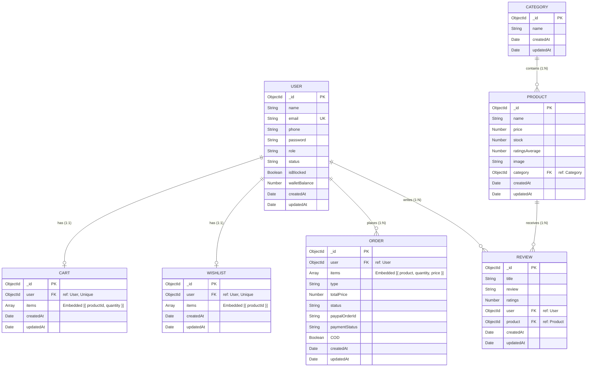

# NodeMart
nodejs ecommerace app api only

# ERD

## Team Members

- [@Youssef Mohamed](https://github.com/Youssefmo7)
- [@Nesma Eid](https://github.com/NESMA47)
- [@Abdo Tolba](https://github.com/DevAbdoTolba)

Supervised by:
[Eng. @Mariam Hady](https://github.com/masterhady)
